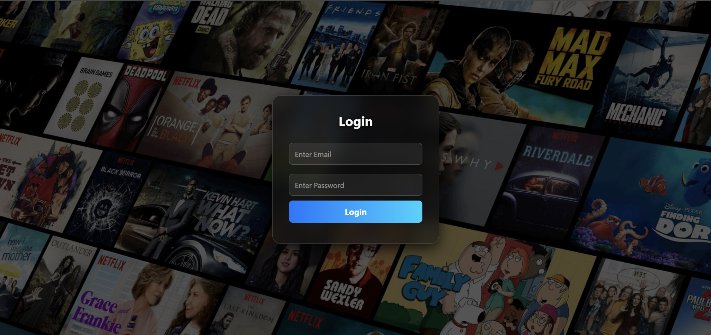
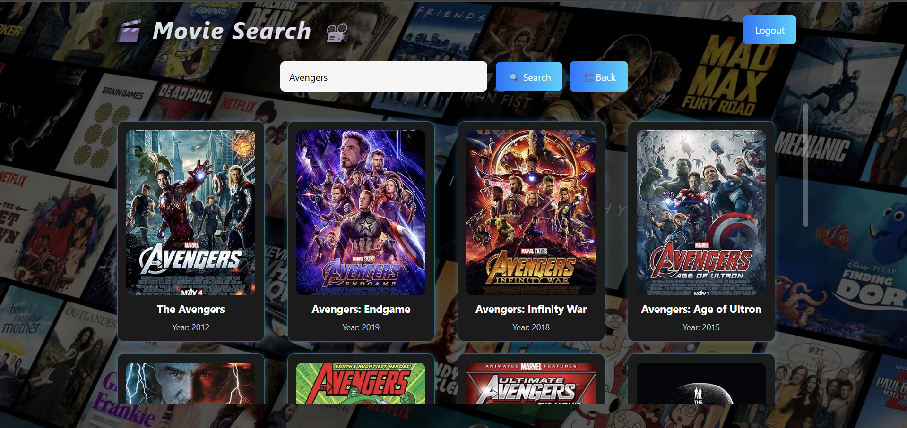
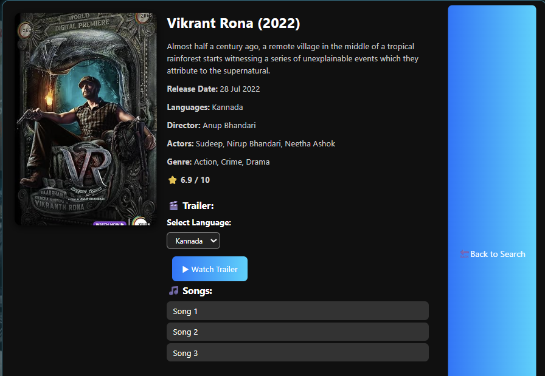

# 🎬 MovieApp

<p align="center">
  
  
  
  
  
</p>

<p align="center">
  <b>Discover, explore and enjoy movies like never before!</b><br/>
  Search movies, view details, watch trailers, and listen to songs – all in one place.
</p>

---

## ✨ Features

- 🔑 **Login System** – Simple user login with validation
- 🎥 **Movie Search** – Powered by [OMDb API](https://www.omdbapi.com/)
- 📝 **Movie Details Page** – Poster, cast, plot, IMDB rating, genre & runtime
- ▶️ **YouTube Trailer Integration** – Watch official trailers inside the app
- 🎶 **Songs Section** – Related music from YouTube
- 📱 **Responsive UI** – Works smoothly across devices
- 💎 **Modern Glassmorphic Design** – Sleek and professional look

---

## 🚀 Demo

🔗 **Live Preview:-** https://harish07466.github.io/MovieApp-/
* Note:- If the Link is Not Working in the Chrome Browser, Copy and paste the Link in Other Browsers like (Microsoft Edge, etc....).

📸 **Screenshots:**

| Login Page | Movie Grid | Movie Detail Page |
| ---------- | ---------- | ---------------- |
|  |  |  |


## 🛠️ Tech Stack

- **Frontend:** HTML, CSS, JavaScript
- **APIs Used:**

  - 🎬 OMDb API (Movies & details)
  - 📺 YouTube Data API (Trailers & songs)

- **Design:** Responsive, card-based, glassmorphic

---

## ⚡ Getting Started

Follow these steps to run the project locally:

### 1️⃣ Clone the repository

```bash
git clone https://github.com/<your-username>/<repo-name>.git
cd <repo-name>
```

### 2️⃣ Open in browser

Simply open `index.html` in your browser.

### 3️⃣ Add API Keys

- Get an OMDb API key → [Get Key](https://www.omdbapi.com/apikey.aspx)
- Get a YouTube Data API key → [Google Cloud Console](https://console.cloud.google.com/)
- Update `script.js`:

```js
const OMDB_API_KEY = "YOUR_OMDB_KEY";
const YOUTUBE_API_KEY = "YOUR_YOUTUBE_KEY";
```

---

## 📂 Project Structure

```
📦 Movie-Explorer
 ┣ 📜 index.html        # Main HTML
 ┣ 📜 style.css         # Styles
 ┣ 📜 script.js         # Functionality
 ┣ 📜 users.json        # Sample users
 ┣ 📂 assets/           # Screenshots / images
 ┗ 📜 README.md         # Documentation
```

---

## 🙌 Contributing

Contributions are always welcome!

1. Fork the project
2. Create your feature branch (`git checkout -b feature/AmazingFeature`)
3. Commit changes (`git commit -m 'Add some AmazingFeature'`)
4. Push to branch (`git push origin feature/AmazingFeature`)
5. Open a Pull Request

---

## 📜 License

This project is licensed under the **MIT License** – you’re free to use, modify, and share it.

---

<p align="center">💻 Developed with ❤️ by <b>Your Name</b></p>
